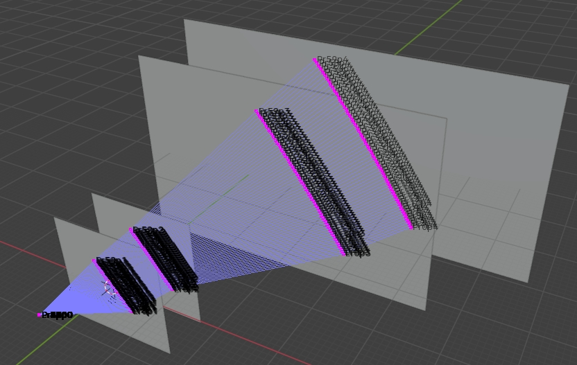

# Blender-ULSL: Underwater Line Structured Light 3D Reconstruction Simulation Toolkit

## 📖 Overview
This repository contains a Blender-based simulation framework for Underwater Line Structured Light (ULSL) 3D reconstruction research. Developed by a Computer Vision PhD candidate, the toolkit aims to:

- 🎯 Validate underwater structured light algorithms through photorealistic simulation
- 🌊 Address challenges in aquatic environment experimentation (refraction, turbidity, light attenuation)
- 🔬 Provide configurable parameters for optical properties and scene geometry

## 😶‍🌫️ ToDo
- [x] Python script for load calibration board
- [x] Python script for load Scene
- [x] Python Script for configure Camera (include Stereo)
- [x] Python Script for Refraction and 3D reconstruction
- [x] Light Reflection
- [x] Line Laser Source Generation
- [ ] bundaryCheck & ray_cast
- [x] Galvanometer Simulation
- [ ] ~~laser illumination effect~~
- [x] create light sphere

## 😸 Comming soon. 努力工作中

